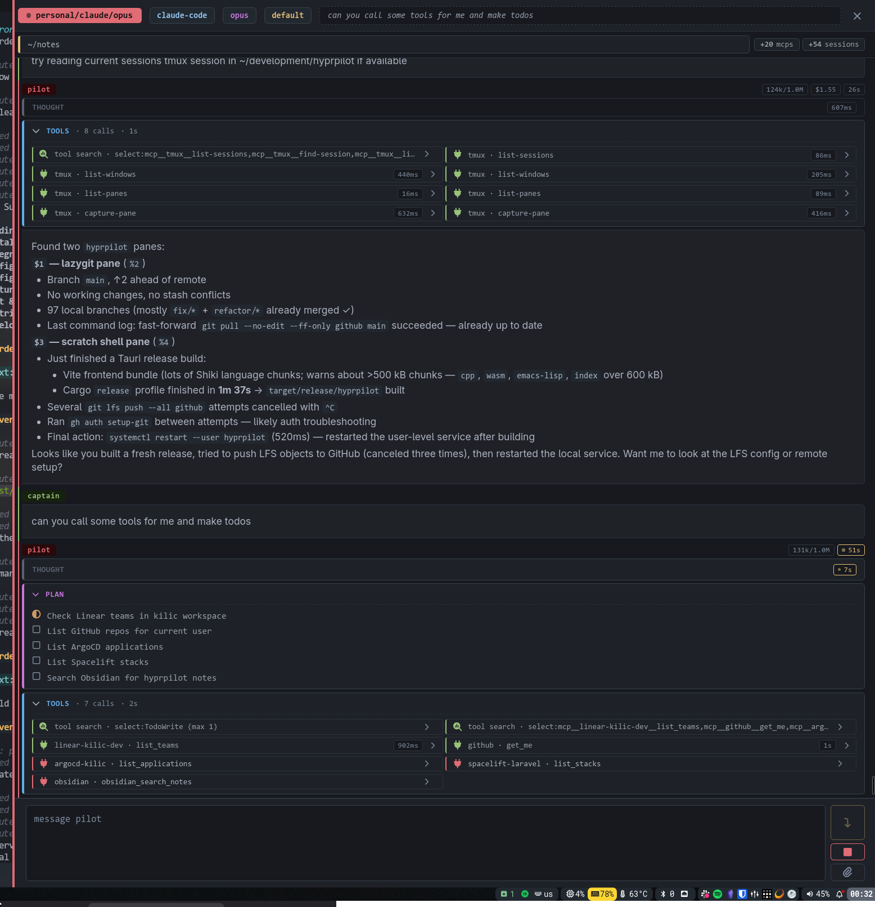

# hyprpilot

**An overlay daemon that runs coding agents at the edge of your screen.**

## DISCLAIMER

This is a ~vibe-coded~ agentically engineered, sorry, ~pos~, sorry, poc project that I have used to sharpen my skills to build a thing from start to finish. I have taken out the overlay I was using which was a pretty basic implementation with GTK and turned it into something that I might use a bit more with a little bit more extendibility.

## Features

This project runs a daemon in the background that is persistent per user and has the ability to spawn multiple agents with different profiles that is configured differently to tailor to your different needs.

It comes bundled with a CLI interface where you can use it to interact with the daemon as well as the agents.

## Documentation

The documentation for the project can be found [here](https://hyprpilot.kilic.dev).
